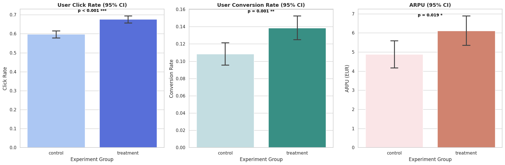

# Social Media A/B Test: Funnel & Revenue Impact Analysis

## Executive Summary
This project evaluates the performance of a new social media campaign creative (Treatment) against the current baseline (Control). By implementing a rigorous statistical pipeline in Python, I analyzed user-level engagement and revenue impact.

**The Bottom Line:** The Treatment variant drove a statistically significant lift in CTR, CR and ARPU. With no significant interaction effects across devices, I recommend a **rollout** of the Treatment campaign.

---

## The Data Pipeline
I implemented a strict integrity pipeline to ensure causal validity:

* **Sample Ratio Mismatch (SRM) Check:** Conducted a Chi-Square test (p=0.9093) to verify that the 50/50 traffic split was not compromised by the randomization engine.
* **Contamination Filter:** Identified and removed users exposed to both variants to prevent "cross-talk" bias.
* **Integrity Scrubbing:** Dropped impossible observations (e.g., clicks > impressions) and rows with missing identifiers.
* **Outlier Management:** Applied **99th percentile Winsorization** specifically to paying users to prevent extreme "whales" from artificially skewing the ARPU.

---

## Key Performance Indicators

I prioritized **User-Level Metrics** over Event-Level logs to ensure the independence of observations—a core requirement for statistical testing.

| Metric | Definition | Purpose |
| :--- | :--- | :--- |
| **User-CTR** | Users with ≥1 click / Total Users | Measures the breadth of campaign appeal. |
| **Conversion Rate (CR)** | Users with ≥1 conv / Total Users | Unconditional metric to avoid selection/collider bias. |
| **ARPU** | Total Revenue / Total Users | The "North Star" financial metric for ROI. |

### Performance Summary
| Group | User-CTR | Conversion Rate | ARPU |
| :--- | :--- | :--- | :--- |
| **Control** | 59.7% | 10.8% | €4.88 |
| **Treatment** | 67.6% | 13.8% | €6.11 |

---

## Statistical Results

### 1. Funnel Performance
Using Proportions Z-Tests (treating the funnel steps as Bernoulli trials), the Treatment showed a significant increase in engagement:
* **User-CTR:** p < 0.001 ***
* **Conversion Rate:** p = 0.001 ***

### 2. Revenue Impact
Revenue data is zero-inflated and right-skewed by a small percentage of high spenders. This makes standard parametric tests invalid for our data.

To bypass these assumptions without resorting to rank-based tests (which ignore the actual monetary value of the revenue), I engineered a non-parametric Bootstrap Resampling simulation (10,000 iterations) to calculate an empirical confidence interval and p-value.

* **P-Value:** 0.0202 *

### 3. Interaction Effects
I ran Logistic Regression (for CTR/CR) and OLS (for ARPU) to check for interactions with `device_type`.
* **Result:** No significant interaction effects were found. This confirms the Treatment's success is universal and not dependent on a specific device category.

---

## Visualization

*Figure 1: Full-funnel impact with 95% Confidence Intervals and Significance Annotations.*

---

## Business Recommendation
Based on the evidence, the Treatment campaign is a clear winner:
1.  **Deploy Globally:** The Treatment variant significantly outperformed the Control, driving a 25.15% lift in ARPU.
2.  **Strong Funnel Efficiency:** The growth was driven by a 13% increase in engagement (CTR) and a 27% increase in conversion intent (CR).
3.  **Universal Performance:** Interaction analysis indicates no performance gap between device types, making this a robust, low-risk rollout.

---

## Tech Stack
* **Language:** Python
* **Libraries:** Pandas, NumPy, Scipy, Statsmodels, Matplotlib, Seaborn
* **Environment:** Google Colab / Jupyter Notebook
