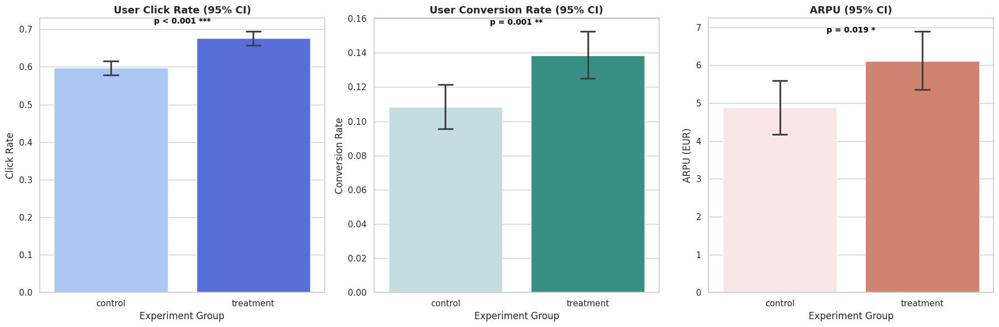

# Social Media A/B Test: Impact on Engagement and Revenue

## Business Context
A new social media campaign creative (Treatment) was tested against the current baseline (Control) to improve user engagement and monetization.

The goal was to evaluate whether the new creative drives higher user interaction and revenue, and whether it should be rolled out at scale.

---

## Objective
Measure the causal impact of the new campaign creative on:
- User engagement (CTR)
- Conversion behavior
- Revenue per user (ARPU)

---

## Experiment Setup
- A/B test with 50/50 traffic split  
- User-level randomization  
- Cleaned dataset after removing invalid and contaminated observations  

---

## Data Validation
To ensure validity of the experiment:

- **Randomization check (SRM):** No imbalance detected (p = 0.909)  
- **Contamination removal:** Users exposed to both variants were excluded  
- **Data cleaning:** Removed inconsistent records (e.g., clicks > impressions)  
- **Outlier handling:** Applied winsorization (99th percentile) on revenue  

---

## Metrics
User-level metrics were used to ensure independence of observations:

- **CTR:** % of users with at least one click  
- **Conversion Rate:** % of users with at least one conversion  
- **ARPU:** Total revenue / total users  

---

## Methodology
- Proportion Z-tests for CTR and Conversion Rate  
- Bootstrap resampling (10,000 iterations) for ARPU due to skewed distribution  

---

## Key Results

The Treatment variant outperformed the Control across all key metrics:

- **CTR:** +7.9 percentage points (67.6% vs 59.7%, p < 0.001)  
- **Conversion Rate:** +3.0 percentage points (13.8% vs 10.8%, p = 0.001)  
- **ARPU:** +€1.23 per user (+25%, €6.11 vs €4.88, p = 0.020)  

---

## Business Impact

The uplift in ARPU translates into a meaningful increase in revenue.

For example:
- +€1.23 per user scales to **+€123,000 per 100,000 users**

This indicates that the Treatment is not only statistically significant, but also economically valuable.

---

## Additional Analysis

- No significant interaction effects across device types  
- Performance improvements are consistent across segments  

This suggests the Treatment effect is robust and generalizable.

---

## Limitations

- The experiment duration may not capture long-term user behavior  
- Results may vary depending on seasonality or campaign context  

---

## Recommendation

Roll out the Treatment campaign globally.

The variant delivers:
- Significant improvements in engagement and conversion  
- Strong and scalable revenue impact  
- Consistent performance across user segments  

### Next Steps
- Monitor ARPU and retention after rollout  
- Validate long-term impact with follow-up analysis  

---

## Tech Stack
- Python  
- Pandas, NumPy  
- SciPy, Statsmodels  
- Matplotlib, Seaborn  
- Jupyter Notebook / Google Colab  

---

## Visualization

*Figure 1: Full-funnel impact with 95% Confidence Intervals and Significance Annotations.*

